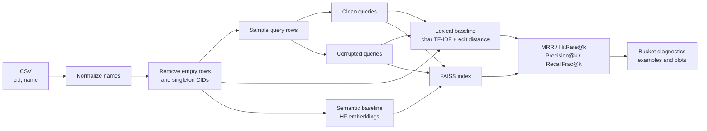

<div align="center">

# ChemSynonymizer

### Large-scale chemical synonym retrieval and name normalization

[](https://www.python.org/)
[](https://pytorch.org/)
[](https://huggingface.co/docs/transformers/)
[](https://github.com/facebookresearch/faiss)
[](notebooks/final_research_analysis.ipynb)

Research code for retrieving equivalent chemical names from compound synonym sets, comparing lexical and neural baselines, testing robustness to noisy names, and fine-tuning SapBERT with CID-based supervision.

[Quick Start](#quick-start) | [Methods](#methods) | [Fine-Tuning](#fine-tuning-sapbert) | [Outputs](#experiment-outputs)

</div>

---

## Overview

Chemical databases often contain many surface forms for the same compound: systematic names, common names, abbreviations, spelling variants, and formatting differences. ChemSynonymizer treats name normalization as a retrieval problem:

> Given one chemical name, retrieve other names associated with the same compound identifier (`cid`).

The project began as a working research prototype and was refactored into a reproducible experiment repository with configurable baselines, cached embeddings, FAISS indexing, robustness evaluation, diagnostics, plots, and task-specific SapBERT fine-tuning.

### Project Highlights

- Processes datasets containing only `cid` and `name`; the reference experiment was designed for tens of millions of chemical-name records.
- Compares character n-gram TF-IDF and edit distance against E5, BGE, BiomedBERT, and SapBERT embeddings.
- Evaluates ranking quality with MRR, HitRate@k, Precision@k, and RecallFrac@k.
- Measures degradation under typos, character swaps, punctuation removal, dropped tokens, and spacing changes.
- Fine-tunes SapBERT with supervised contrastive or triplet loss, with optional hard-negative sampling.
- Caches corpus/query embeddings by dataset and model configuration so expensive A100 runs can be resumed.

## Research Questions

1. Do semantic embedding models outperform lexical similarity for chemical synonym retrieval?
2. How much do domain-specific and synonym-specific pretraining contribute?
3. Can tuned embeddings generalize to unseen surface forms or unseen compounds?
4. How stable is retrieval under realistic corruption of chemical names?
5. How does performance vary with the number of known synonyms per compound?

## System Pipeline



Names are normalized with Unicode NFKC, lowercasing, trimming, and whitespace collapsing. Query rows remain in the retrieval corpus, but each query's self-match is removed before scoring.

## Data Format

Only two columns are required:

| Column | Description | Example |
|---|---|---|
| `cid` | Identifier shared by names for the same compound | `1983` |
| `name` | Chemical name or synonym | `acetaminophen` |

```csv
cid,name
1983,acetaminophen
1983,paracetamol
1983,APAP
3672,sodium chloride
3672,common salt
```

Singleton CIDs are removed by default because they contain no valid synonym to retrieve.

## Methods

### Retrieval Baselines

| Method | Model / Technique | Purpose |
|---|---|---|
| Lexical | Character 3-5 gram TF-IDF + edit-distance reranking | Strong spelling-based baseline |
| General retrieval | E5 Base, E5 Large, BGE Base | Tests modern retrieval training without chemical specialization |
| Biomedical language | BiomedBERT | Tests whether domain vocabulary alone improves retrieval |
| Synonym-specialized | SapBERT | Tests concept/synonym alignment learned from biomedical terminology |
| Task-tuned | Fine-tuned SapBERT | Tests whether CID supervision improves this specific dataset |

Model IDs, prefixes, and pooling strategies are defined in [`configs/models.yaml`](configs/models.yaml).

### Evaluation Metrics

| Metric | Interpretation |
|---|---|
| **MRR** | How highly the first correct synonym is ranked |
| **HitRate@k** | Fraction of queries with at least one correct synonym in the top `k` |
| **Precision@k** | Fraction of the top `k` results that share the query CID |
| **RecallFrac@k** | Fraction of the query's available synonyms retrieved in the top `k` |

Metrics are also reported by synonym-set-size bucket: `2`, `3-5`, `6-10`, `11-20`, and `21+`.

### Robustness Evaluation

The clean retrieval corpus is held fixed while query names are corrupted at multiple levels:

| Corruption | Clean query | Example corrupted query |
|---|---|---|
| Typo | `acetaminophen` | `acetaminophem` |
| Character swap | `ibuprofen` | `ibuporfen` |
| Dropped punctuation | `N,N-dimethylformamide` | `NN dimethylformamide` |
| Dropped token | `sodium chloride solution` | `sodium chloride` |
| Spacing change | `hydrochloric acid` | `hydro chloricacid` |

The resulting degradation curves measure whether a model learned stable name representations rather than relying on exact string memorization.

## Quick Start

### Recommended: Google Colab

The end-to-end notebook is the primary workflow for large experiments:

**[`notebooks/final_research_analysis.ipynb`](notebooks/final_research_analysis.ipynb)**

1. Open the notebook in Colab and select a GPU runtime.
2. Run the dependency-install cell.
3. Mount Google Drive.
4. Set `REPO_DIR` and `CSV_PATH`.
5. Use `LIMIT_ROWS = 5000` for a smoke test, then `None` for the full run.
6. Choose which baselines, robustness runs, and SapBERT fine-tuning objectives to execute.

The notebook is optimized for an A100 with 80 GB GPU memory. It runs expensive embedding and indexing work from Colab local scratch while persisting results and selected caches to Google Drive.

### Local Installation

```bash
cd chem_synonymizer
python -m venv .venv
```

Windows PowerShell:

```powershell
.\.venv\Scripts\Activate.ps1
pip install -r requirements.txt
```

macOS/Linux:

```bash
source .venv/bin/activate
pip install -r requirements.txt
```

`requirements.txt` installs CPU FAISS. Install a compatible GPU FAISS build separately for CUDA indexing.

### Local Smoke Test

The lexical baseline is the lightest way to verify the data and evaluation path:

```bash
python scripts/run_lexical_baseline.py \
  --csv-path /path/to/chemicals.csv \
  --limit-rows 5000 \
  --eval-frac 0.1
```

For a small CPU semantic test:

```bash
python scripts/run_semantic_baseline.py \
  --csv-path /path/to/chemicals.csv \
  --model-key sapbert \
  --limit-rows 5000 \
  --eval-frac 0.1 \
  --device cpu \
  --faiss-device cpu \
  --index-type flat \
  --set model.batch_size=64 \
  --set model.query_batch_size=128
```

## Running Experiments

### Lexical Baseline

```bash
python scripts/run_lexical_baseline.py \
  --csv-path /path/to/chemicals.csv \
  --run-name lexical
```

### Semantic Baseline and Robustness

```bash
python scripts/run_semantic_baseline.py \
  --csv-path /path/to/chemicals.csv \
  --model-key sapbert \
  --run-name sapbert \
  --device cuda \
  --faiss-device cuda \
  --index-type ivf_flat \
  --run-robustness
```

Supported pretrained keys:

```text
e5_base  e5_large  bge_base  biomedbert  sapbert
```

### All Baselines

```bash
python scripts/run_all_baselines.py \
  --csv-path /path/to/chemicals.csv \
  --semantic-models e5_base e5_large bge_base biomedbert sapbert \
  --make-plots
```

### Standalone Robustness Run

```bash
python scripts/run_robustness.py \
  --csv-path /path/to/chemicals.csv \
  --baseline semantic \
  --model-key sapbert
```

## Fine-Tuning SapBERT

Each fine-tuning experiment starts from the same pretrained SapBERT checkpoint. Contrastive and triplet models are separate comparisons; they are not trained sequentially on top of each other.

### Supervised Contrastive Loss

Samples synonym pairs from the same CID and treats other CIDs in the batch as negatives:

```bash
python scripts/run_sapbert_finetuning.py \
  --csv-path /path/to/chemicals.csv \
  --objective contrastive \
  --run-name sapbert_contrastive \
  --device cuda
```

### Triplet Loss

Trains on `(anchor, positive synonym, wrong-CID negative)` triplets:

```bash
python scripts/run_sapbert_finetuning.py \
  --csv-path /path/to/chemicals.csv \
  --objective triplet \
  --run-name sapbert_triplet \
  --device cuda
```

Add `--use-hard-negatives` to prefer lexically similar names from different CIDs:

```bash
python scripts/run_sapbert_finetuning.py \
  --csv-path /path/to/chemicals.csv \
  --objective triplet \
  --run-name sapbert_triplet_hard \
  --device cuda \
  --use-hard-negatives
```

The default `surface` split holds sampled query strings out of training while allowing other names from the same compounds to remain. A compound-level split is also available:

```bash
--set finetune.split=compound
```

## Configuration

Experiment defaults live in [`configs/base.yaml`](configs/base.yaml). Any nested value can be overridden without editing the file:

```bash
python scripts/run_semantic_baseline.py \
  --csv-path /path/to/chemicals.csv \
  --model-key e5_base \
  --set eval.seed=7 \
  --set model.batch_size=4096 \
  --set semantic.search_batch_size=512
```

Important settings:

| Section | Controls |
|---|---|
| `data` | CSV path, column names, normalization, singleton filtering |
| `eval` | Seed, query fraction, `k` values, example count |
| `model` | Maximum length, encoding batch sizes, embedding dtype |
| `semantic` | FAISS type/device, `nlist`, `nprobe`, training/add/search batches |
| `lexical` | Character n-grams, reranking, candidate count, parallel jobs |
| `robustness` | Corruption levels and operations |
| `finetune` | Objective hyperparameters, split, precision, hard-negative behavior |

## Caching and Reproducibility

Semantic caches are keyed by:

- CSV fingerprint and preprocessing settings
- model name/checkpoint and pooling strategy
- maximum token length, output dtype, and normalization
- query split and corruption configuration
- FAISS index configuration

This prevents embeddings or indexes from being silently reused across incompatible datasets or models.

```text
cache/
`-- semantic/
    `-- data_{data_key}/
        `-- {model_key}_{embedding_key}/
            |-- corpus_embeddings.npy
            |-- queries/
            |   |-- split_{query_key}/query_embeddings.npy
            |   `-- robust_{query_key}/query_embeddings.npy
            `-- indexes/
                `-- index_{index_key}/faiss_*.index
```

In Colab, the active cache uses local scratch for speed. Embeddings can be backed up to Drive after each model, while very large IVF-flat indexes are skipped by default.

## Experiment Outputs

Each run writes to a stable model/baseline folder:

```text
results/{run_name}/
|-- config.json
|-- cache_info.json
|-- metrics.json
|-- bucket_metrics.csv
|-- examples.csv
|-- robustness_metrics.csv
|-- artifacts/
|   |-- prepared_data.csv
|   |-- query_indices.csv
|   `-- model/                 # fine-tuned checkpoints
`-- plots/
    |-- mrr_by_model.png
    |-- hitrate_by_model.png
    |-- bucket_mrr.png
    `-- robustness_mrr.png
```

Generate cross-run plots with:

```bash
python scripts/make_plots.py
```

Large datasets, embeddings, indexes, checkpoints, and result artifacts are intentionally excluded from Git.

## Repository Structure

```text
chem_synonymizer/
|-- configs/
|   |-- base.yaml
|   `-- models.yaml
|-- notebooks/
|   `-- final_research_analysis.ipynb
|-- scripts/
|   |-- run_lexical_baseline.py
|   |-- run_semantic_baseline.py
|   |-- run_all_baselines.py
|   |-- run_robustness.py
|   |-- run_sapbert_finetuning.py
|   `-- make_plots.py
|-- src/chem_synonymizer/
|   |-- data.py
|   |-- normalize.py
|   |-- split.py
|   |-- lexical.py
|   |-- embed.py
|   |-- index.py
|   |-- evaluate.py
|   |-- corruptions.py
|   |-- finetune.py
|   |-- diagnostics.py
|   |-- plots.py
|   `-- utils.py
|-- results/
|-- requirements.txt
`-- README.md
```

## Project Status

- [x] Reproducible lexical and semantic retrieval pipelines
- [x] Model-aware embedding and FAISS caches
- [x] Robustness evaluation over multiple corruption levels
- [x] Synonym-set-size diagnostics and publication-ready output tables
- [x] SapBERT contrastive and triplet fine-tuning
- [x] Optional hard-negative sampling
- [ ] Threshold calibration for production-style normalization decisions
- [ ] Expanded error taxonomy for abbreviations, salts, stereochemistry, and near-duplicate compounds
- [ ] Optional identifier/SMILES supervision when those columns are available

## Reproducibility Notes

- Random sampling and corruption generation are seed-controlled.
- Exact query self-matches are removed before evaluation.
- Fine-tuned variants start from the same base SapBERT checkpoint.
- The repository runs with only `cid` and `name`; structural or identifier features are optional future ablations.
- Default semantic settings target a high-memory A100. Use the local smoke-test overrides for smaller hardware.

## License

The source code is licensed under the [MIT License](LICENSE).

The chemical synonym dataset is not included in this repository and is not
covered by the MIT License. Data obtained from PubChem remains subject to the
policies and terms of its original provider. Pretrained models and third-party
dependencies remain subject to their respective licenses.
